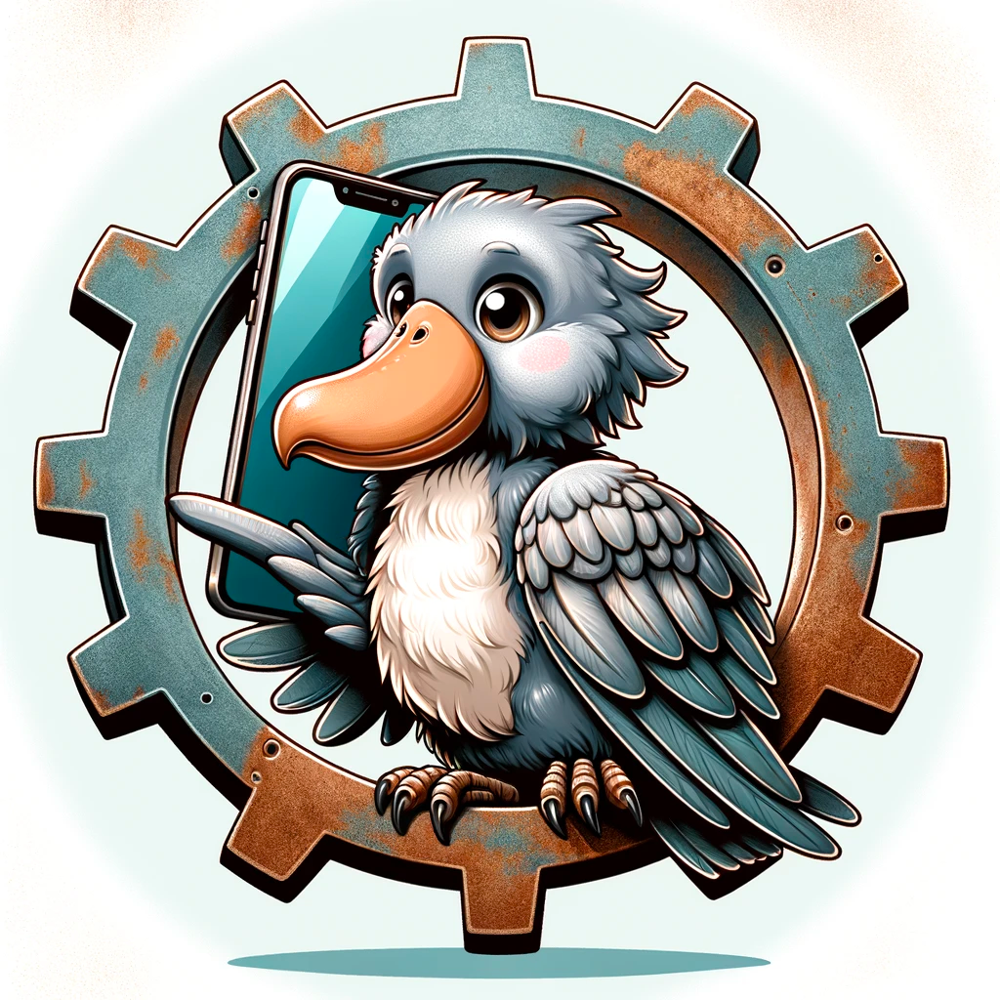

# RustGPTPhoneBot
###### Rust-based phone bot (GPT) for E-Commerce using local mobile numbers

## Overview
RustGPTPhoneBot is a Rust-based phone based on GPT-3 designed to assist customers of Shoppers Drug Mart, Instacart , Walmart etc... It integrates advanced AI-driven chat capabilities, providing real-time assistance and information.
over local mobile numbers
It's also almost ready to control your voicemail 

## Key Features
- **FAQ Assistance**: Offers detailed answers to frequently asked questions about Shoppers Drug Mart.
- **CSAT Survey Implementation**: Conducts customer satisfaction surveys using Structured Synthetic Markup Language (SSML) for enhanced interaction.
- **ChatGPT Integration**: Leverages OpenAI's ChatGPT for natural language processing and response generation.
- **Real-time Interaction**: Handles customer queries in real-time, offering a seamless user experience.

## Technical Stack
- **Rust**: Core programming language for performance and safety.
- **Warp**: For RESTful API creation and handling HTTP requests.
- **Tokio**: Asynchronous runtime for non-blocking operation.
- **Serde**: For serialization and deserialization of data.
- **Lazy Static**: For efficient memory management and performance optimization.

## Functionality
- **Interactive Conversations**: Engages users with context-aware responses, guided by pre-defined scripts and user inputs.
- **Environment Variables Management**: Handles sensitive data like API keys securely through environment variables.
- **Error Handling**: Robustly manages potential errors, ensuring uninterrupted service.

## Usage
- **Customer Interaction**: Assists customers with inquiries related to Shoppers Drug Mart products, orders, and services.
- **Survey Execution**: Collects customer feedback through structured surveys, using SSML for an engaging experience.

## Deployment and Configuration
- Utilizes environmental variables for secure configuration of API keys and endpoints.
- Configurable for different operational modes, including standard and streaming chat interactions.
- Docker file ready for GCP deployment
- for MAC dev you need install MicrosoftCognitiveServicesSpeech.xcframework https://aka.ms/csspeech/macosbinary 

Functionality
-------------

-   Call Management: Handles call events like initiation, answering, and hangup.
-   Audio Streaming: Manages real-time audio data streaming via WebSockets.
-   Speech Recognition and Synthesis: Converts speech to text and synthesizes text to speech.
-   AI-Driven Interaction: Utilizes GPT models for generating human-like responses.
-   Error Handling and Logging: Robust error management and detailed logging for diagnostics.

The bot exemplifies a modern approach to telecommunication, combining cloud-based services with advanced AI models, and highlights Rust's capability in handling concurrent, real-time communication tasks.

## Key Environment Variables
- `TELNYX_API_KEY`: Key for Telnyx API integration.
- `TELNYX_API_URL`: Base URL for Telnyx API calls.
- `REDIS_URI`: URI for Redis server connection.
- `REDIS_PORT`: Port number for Redis server.
- `REDIS_PASSWORD`: Password for Redis server access.
- `OPENAI_KEY`: API key for OpenAI's services.
- `MSServiceRegion`: Microsoft Cognitive Services region.
- `MSSubscriptionKey`: Subscription key for Microsoft Cognitive Services.
- `RUST_LOG`: Logging level for the Rust application.
- `RUST_BACKTRACE`: Enables backtracing for debugging in Rust.
- export MSServiceRegion=eastus
- export DYLD_FALLBACK_FRAMEWORK_PATH=~/speechsdk/MicrosoftCognitiveServicesSpeech.xcframework/macos-arm64_x86_64 // only macos for linux it's set in docker
- export MACOS_SPEECHSDK_ROOT=/Users/[YOUR USER NAME ]/speechsdk

## Initialization
These variables are set at the beginning of the `main` function, ensuring all services and APIs are correctly configured before the server starts.

## Logging and Debugging
The application uses `env_logger` for initializing the logging framework, controlled by the `RUST_LOG` and `RUST_BACKTRACE` variables.

## Server Routes
The server routes for handling webhook and WebSocket connections are defined using Warp, with the WebSocket route handling real-time communication based on the `call_id`.

## Execution
The server is executed on the specified `PORT`, defaulting to 8080, making it compatible with various hosting environments, including cloud platforms.